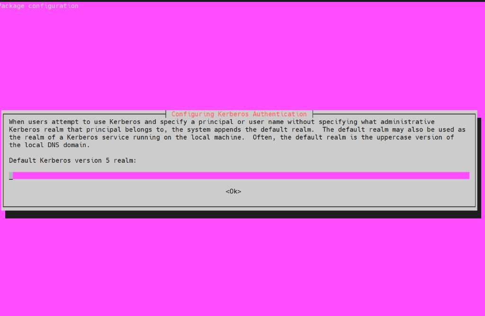
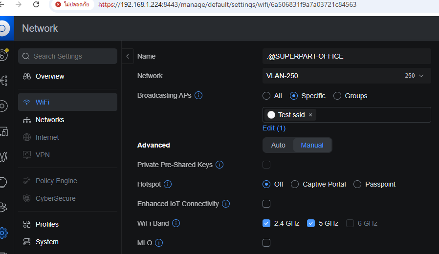
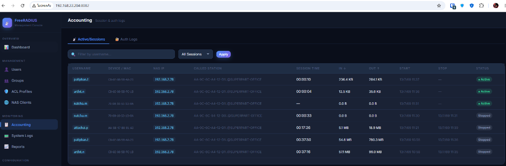
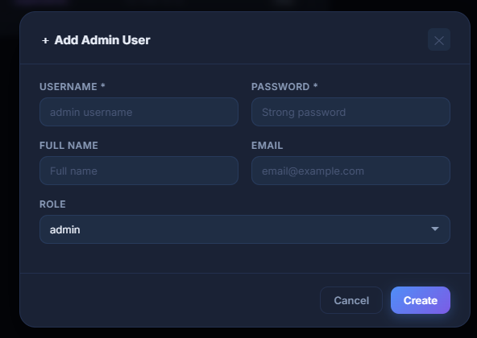
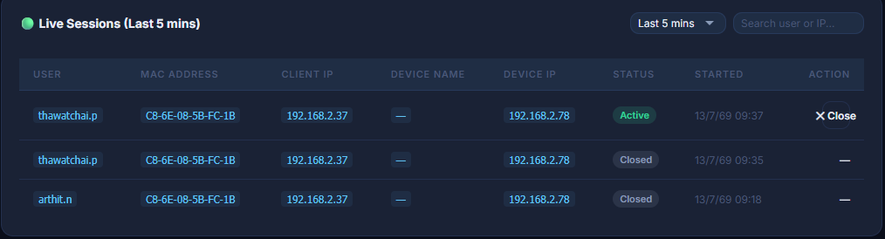
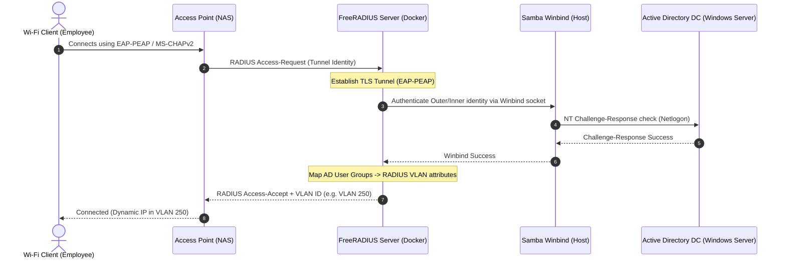
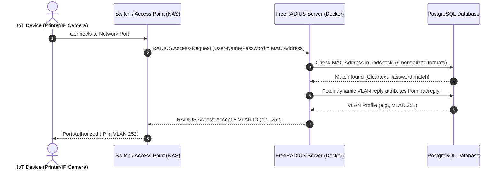
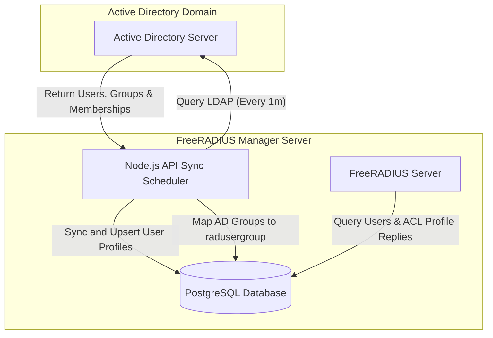

# FreeRADIUS Manager — Enterprise Docker Setup & User Manual

An enterprise-grade, dockerized FreeRADIUS management system with web-based administration console, automatic Active Directory (AD) synchronization, dynamic VLAN routing, and MAC Authentication Bypass (MAB) device registry.

---

## 🖼️ Web Portal Screenshots

<p align="center">
  
  
</p>
<p align="center">
  
  
</p>
<p align="center">
  
</p>

---

## ⛓️ System Architecture & Workflow Diagrams

### 1. Active Directory authentication via EAP-PEAP / MS-CHAPv2
This sequence diagram shows how a Wi-Fi client authenticates against Active Directory through FreeRADIUS and Samba Winbind.



### 2. MAC Authentication Bypass (MAB) for IoT Devices
This flow shows how devices lacking EAP support (e.g. printers, IP cameras) get authenticated and mapped to their respective VLANs.



### 3. Active Directory User and Group Synchronization
The background sync daemon regularly queries Active Directory and maintains local cache in PostgreSQL database to keep users and groups aligned.



---

## 🌟 Key Features

*   **Enterprise AD Sync**: Real-time background cron job to sync users, groups, and department mappings from Active Directory.
*   **MS-CHAPv2 & PEAP Support**: Secure 802.1X enterprise Wi-Fi authentication utilizing Samba Winbind integration.
*   **Dynamic VLAN Routing**: Predefined ACL profiles (VLAN, Cisco privilege level 15, Aruba User Role) assigned dynamically on successful login.
*   **Multi-Group AD Support**: Automated `Fall-Through := Yes` database reply attribute merging, enabling users in multiple AD groups to retrieve all their respective RADIUS attributes (e.g. Cisco shell privilege and Wi-Fi VLAN 250).
*   **MAC Authentication Bypass (MAB) / Device Registry**: Dedicated inventory page for IoT, printers, and cameras. Registers devices automatically in **6 compatibility formats** (raw, colon, and hyphen hex in both uppercase and lowercase) to guarantee out-of-the-box compatibility with any AP or switch vendor.
*   **AD-Integrated Web Admin Console**: Promote any synced AD or local user to Web Console Administrator. AD admins authenticate securely to the console using their actual AD domain passwords.
*   **Web Management Portal**: Fully responsive dashboard with real-time stats, Live Session controls (force disconnection), System Logs viewer with keyword filtering, and reporting utilities.

---

## 📋 Prerequisites & Requirements

Before deploying, ensure the host system has:
1.  **Docker & Docker Compose v2** installed.
2.  **Network Access** to the Active Directory Domain Controller (DC) (e.g., `192.168.22.225` on LDAP port `389` or LDAPS `636`).
3.  **Host Joined to Active Directory**: The host Ubuntu server must be joined to the AD domain with `winbindd` active so the docker container can delegate MS-CHAPv2 authentication to the host.

---

## 🏢 Step-by-Step Active Directory Host Join Guide

To support WPA2-Enterprise (PEAP/MS-CHAPv2) authentication, the host Ubuntu server must be joined to the domain. Run these commands on the **host machine**:

### 1. Install Domain Joining Packages
```bash
sudo apt update
sudo apt install -y realmd sssd sssd-tools samba-common-bin oddjob oddjob-mkhomedir packagekit winbind libpam-winbind libnss-winbind
```

### 2. Discover and Join the Domain
```bash
# Discover the AD Domain
realm discover YOURDOMAIN.LOCAL

# Join the domain using domain administrator credentials
sudo realm join -U Administrator YOURDOMAIN.LOCAL
```

### 3. Verify AD Winbind Connection
Ensure that the host winbind daemon is running and can talk to Active Directory:
```bash
sudo systemctl enable --now winbind

# Verify domain info
wbinfo -t
wbinfo -u
```

### 4. Locate the host `winbindd_priv` GID
FreeRADIUS runs inside Docker as the `freerad` user. To read the host's winbind socket `/run/samba/winbindd/winbindd_privileged`, the container GID must match the host's `winbindd_priv` GID:
```bash
getent group winbindd_priv
# Output example: winbindd_priv:x:986:
```
*   *Note: If the GID returned on your host is different than `986`, update the group GID inside the `freeradius/Dockerfile` (line `RUN groupmod -g 986 winbindd_priv`) to match your host GID.*

---

## 🚀 Quick Start & Installation

```bash
# 1. Clone and enter directory
git clone https://github.com/pirateszero92/free-redius.git
cd free-redius

# 2. Copy environment file template
cp .env.example .env

# 3. Edit .env (adjust production passwords, domain DC configurations, or secret keys)
nano .env

# 4. Build and start all services
sudo docker compose up -d --build
```
Wait ~30 seconds for the containers to fully start and run database migrations. The Web Portal is accessible at:
**`http://<your_server_ip>`** (Port 80)

*   **Default Credentials**: `admin` / `Admin@1234` (Go to **Settings → Change Password** immediately after logging in).

---

## 📦 Services

| Service | Port | Description |
|---|---|---|
| **nginx** | `80` (external) | Serves the static Web UI and reverse-proxies API requests. |
| **api** | `3000` (internal) | Node.js REST API providing backend routes and Active Directory Sync cron scheduler. |
| **freeradius** | `1812/udp`, `1813/udp` | RADIUS server for Authentication and Accounting requests. |
| **postgres** | `5432` (internal) | PostgreSQL Database storing user profiles, group profiles, device registry, and accounting records. |

---

## 📖 Web UI Configuration Guide

### 1. Configure AD Settings
*   Navigate to **Settings → Active Directory**.
*   Enter your Domain Host IP, Port, Base DN, Bind DN, and password.
*   Click **Test Connection** to confirm connectivity.
*   Once saved, scroll to the bottom, select the specific AD groups you wish to sync (e.g. `IT`, `MIS`), and click **Sync Now**.
*   The background sync cron job will run automatically every minute to sync membership changes from AD.

### 2. Configure Dynamic VLANs (ACL Profiles)
*   Navigate to **ACL Profiles** → click **+ Add Profile**.
*   Create a profile (e.g. `MIS VLAN 250`):
    *   **Vendor**: `unifi`
    *   **ACL Type**: `vlan`
    *   **Value**: `250`
*   Go to **Groups** → Edit the `MIS` group and select `MIS VLAN 250` as its ACL Profile.
*   All users in the `MIS` group will now be dynamically routed to VLAN 250 upon connecting to the SSID.

### 3. Register MAB Devices (IoT/Printers)
*   Go to **Devices** → click **+ Register Device**.
*   Enter the device MAC address (e.g. `C8:6E:08:5B:4A:23` or `c86e085b4a23`), name, and select a VLAN ACL Profile.
*   Once saved, the device will immediately bypass 802.1X authentication and get routed to its designated VLAN.

### 4. Add Web Administrators (Promote Users)
*   Go to **Settings → Admin Users** → click **+ Add Admin**.
*   To promote an existing AD user (like `arthit.n`), select them from the **Promote Existing User** dropdown.
*   Set their Authentication Source to **Active Directory (AD)**. The password field will be hidden.
*   Click **Create**. The user `arthit.n` can now log in to this console using their corporate AD password.

---

## 🛠️ Common Admin Commands

### Stream RADIUS Server Logs
```bash
docker compose logs -f freeradius
```

### Search System Logs from CLI
```bash
docker logs freeradius-server 2>&1 | grep -i "arthit.n"
```

### Simulate RADIUS Authentication (Test login from host)
```bash
docker exec -it freeradius-server radtest arthit.n 'YourPassword' 127.0.0.1 0 testing123
```

### Enter PostgreSQL Database Console
```bash
docker exec -it freeradius-postgres psql -U radius -d radius
```
